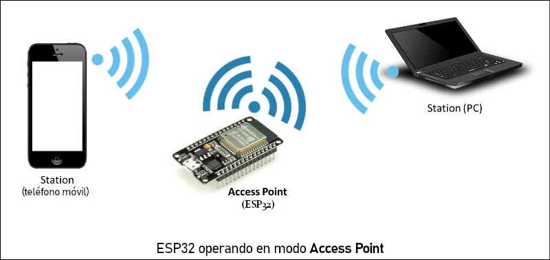

# 📌 Explicación del Código para ESP32  

Este código permite que un **ESP32** se conecte a una red **WiFi** y envíe datos a un servidor web mediante una solicitud **HTTP POST**.  

---

## 🖼️ **Funcionamiento**  

---

## 1️⃣ **Conexión a WiFi**  
- El ESP32 intenta conectarse a una red WiFi utilizando el **SSID** y la **contraseña** definidos en el código.  
- Si la conexión no se establece después de varios intentos, el dispositivo **se reinicia automáticamente**.  
- Una vez conectado, muestra un mensaje en el **Monitor Serial** indicando que la conexión ha sido exitosa.  

---

## 2️⃣ **Envío de datos al servidor**  
- Se genera una variable llamada **RFID**, que en este caso tiene un valor simulado.  
- Se construye una solicitud **HTTP POST** con los datos a enviar en el formato `application/x-www-form-urlencoded`.  
- La solicitud se envía a una **URL específica**, donde un archivo PHP en el servidor recibe los datos.  

---

## 3️⃣ **Recepción de la respuesta del servidor**  
- Si la solicitud HTTP se procesa correctamente y el servidor responde con un **código 200 (OK)**, el ESP32 lee y muestra la respuesta en el **Monitor Serial**.  
- Si ocurre un error, imprime el código de error correspondiente.  

---

## 4️⃣ **Finalización del proceso**  
- Después de procesar la respuesta del servidor, el ESP32 **cierra la conexión HTTP** para liberar recursos.  
- Luego, el ciclo `loop()` se ejecuta nuevamente, repitiendo el proceso de envío de datos.  

---

📌 Puedes ver el código aquí:  
➡️ [Codigo_wifi.ino](https://github.com/VictorPM19/Actividades-esp32/tree/main/Wifi/Codigo_wifi)

