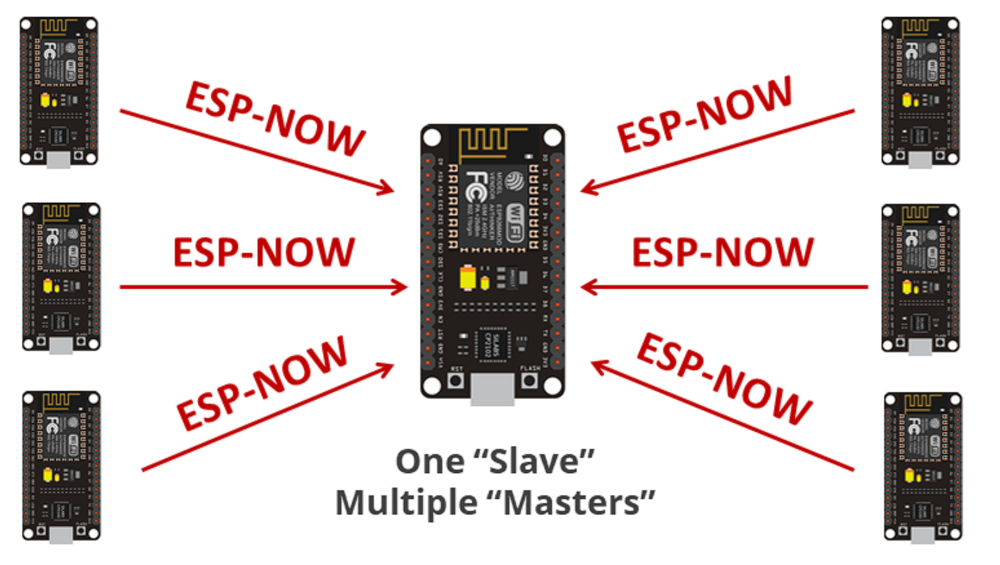

# 📌 Explicación del Código para ESP32  

Este código permite que un **ESP32** se conecte a una red **WiFi** y envíe datos a un servidor web mediante una solicitud **HTTP POST**.  

---

## 🖼️ **Funcionamiento**  

---

## 1️⃣ **Conexión a WiFi**  
- El ESP32 intenta conectarse a una red WiFi utilizando el **SSID** y la **contraseña** definidos en el código.  
- Si la conexión no se establece después de varios intentos, el dispositivo **se reinicia automáticamente**.  
- Una vez conectado, muestra un mensaje en el **Monitor Serial** indicando que la conexión ha sido exitosa.  

---

## 2️⃣ **Envío de datos al servidor**  
- Se genera una variable llamada **RFID**, que en este caso tiene un valor simulado.  
- Se construye una solicitud **HTTP POST** con los datos a enviar en el formato `application/x-www-form-urlencoded`.  
- La solicitud se envía a una **URL específica**, donde un archivo PHP en el servidor recibe los datos.  

---

## 3️⃣ **Recepción de la respuesta del servidor**  
- Si la solicitud HTTP se procesa correctamente y el servidor responde con un **código 200 (OK)**, el ESP32 lee y muestra la respuesta en el **Monitor Serial**.  
- Si ocurre un error, imprime el código de error correspondiente.  

---

## 4️⃣ **Finalización del proceso**  
- Después de procesar la respuesta del servidor, el ESP32 **cierra la conexión HTTP** para liberar recursos.  
- Luego, el ciclo `loop()` se ejecuta nuevamente, repitiendo el proceso de envío de datos.  

---

📌 Puedes ver el código aquí:  
➡️ [Codigo_wifi.ino](https://github.com/VictorPM19/Actividades-esp32/tree/main/Wifi/Codigo_wifi)

# 📡 Conexión de Múltiples ESP32 con ESP-NOW  

ESP-NOW es un protocolo de comunicación inalámbrica desarrollado por **Espressif**, que permite conectar **dos o más ESP32** sin necesidad de WiFi ni Internet.  

---

## ✅ ¿Cómo Funciona ESP-NOW?  
- Utiliza un **protocolo similar al WiFi**, pero con menor latencia y menor consumo de energía.  
- Permite comunicación **punto a punto** o en una **red de múltiples dispositivos**.  
- Se basa en una arquitectura **Maestro-Esclavo** o **Multicast**, donde un ESP32 puede enviar y recibir datos de varios otros ESP32.  
- **No necesita un router ni acceso a Internet** para funcionar.  

---

## 📌 Ventajas de ESP-NOW  
✅ **Baja latencia**: Transmisión de datos casi instantánea.  
✅ **Bajo consumo de energía**: Ideal para dispositivos de bajo consumo.  
✅ **No requiere WiFi**: Funciona sin router ni red local.  
✅ **Conexión con hasta 20 dispositivos**.  
✅ **Seguro**: Soporta encriptación para mayor seguridad.  

---

## 🔗 Aplicaciones de ESP-NOW  
🚗 **Automatización del hogar**: Control de luces, sensores y actuadores sin depender de WiFi.  
📡 **Monitoreo de sensores**: Recoger datos de sensores remotos y enviarlos a un nodo central.  
🎮 **Controles remotos**: Comunicación rápida para robots o dispositivos inalámbricos.  

---
# 📡 Comunicación ESP-NOW: Maestro y Esclavo  

ESP-NOW permite la comunicación inalámbrica entre múltiples **ESP32** sin necesidad de WiFi. Se puede configurar en una arquitectura **Maestro-Esclavo**, donde un ESP32 **Maestro** envía datos a uno o varios ESP32 **Esclavos**.  

---

## 🖼️ **Funcionamiento**  

## ✅ ¿Cómo funciona la comunicación Maestro-Esclavo en ESP-NOW?  
- El **Maestro** envía datos a uno o varios **Esclavos**.  
- Los **Esclavos** solo reciben datos y responden si están configurados para ello.  
- No es necesario que los dispositivos estén conectados a WiFi.  
- Es posible enviar datos a **múltiples dispositivos** al mismo tiempo.  

---

# 📡 ESP-NOW: ESP32 Esclavo (Receptor)  

Este documento describe el funcionamiento del código de un **ESP32 configurado como dispositivo Esclavo** utilizando el protocolo de comunicación **ESP-NOW**.  

El ESP32 **recibe datos desde un ESP32 Maestro** y los procesa para su visualización en el **Monitor Serie**.  

---

## 📌 Esp32 Esclavo  

### 1️⃣ **Inclusión de librerías**  
Se incluyen las librerías necesarias para manejar la comunicación ESP-NOW:  

- `WiFi.h`: Permite configurar el ESP32 en modo Wi-Fi.  
- `esp_now.h`: Habilita la comunicación ESP-NOW entre dispositivos ESP32.  

---

### 2️⃣ **Definición de la estructura de datos**  
Se define una estructura **`struct_message`** que contiene cinco variables:  

- **`a`** → Cadena de caracteres (`char[32]`).  
- **`b`** → Número entero (`int`).  
- **`c`** → Número decimal (`float`).  
- **`d`** → Texto dinámico (`String`).  
- **`e`** → Valor booleano (`true/false`).  

Esta estructura permite enviar múltiples tipos de datos en un solo mensaje.  

---

### 3️⃣ **Inicialización del ESP-NOW**  
Para que el ESP32 pueda recibir datos, se realizan los siguientes pasos:  

1. Se configura el ESP32 en **modo estación (`WIFI_STA`)** para habilitar ESP-NOW.  
2. Se inicializa **ESP-NOW**.  
3. Se registra una función **callback (`OnDataRecv`)** que se ejecuta automáticamente cuando el dispositivo recibe datos.  

---

### 4️⃣ **Recepción y procesamiento de datos**  
Cuando el **ESP32 Esclavo recibe datos**, el sistema:  

1. **Copia la información** recibida en una variable de tipo `struct_message`.  
2. **Muestra los datos en el Monitor Serie**, incluyendo caracteres, números y valores booleanos.  
3. **Realiza operaciones matemáticas** con los datos:  
   - **Suma 1** al valor del entero `b`.  
   - **Suma 0.22** al valor flotante `c`.  
4. **Imprime los resultados procesados** en la consola.  

---

## 📜 **Código para su consulta**  
📌 **Puedes consultar el código completo en el siguiente archivo:**  

[`📂 Codigo ESP32 Esclavo`](ruta/del/archivo.ino)  

# 📡 ESP-NOW: ESP32 Maestro (Transmisor)  

Este documento describe el funcionamiento del código de un **ESP32 configurado como dispositivo Maestro**, utilizando el protocolo de comunicación **ESP-NOW**.  

El ESP32 **envía datos a un ESP32 Esclavo** y verifica si la transmisión fue exitosa o fallida.  

---

## 📌 Descripción del Código  

### 1️⃣ **Inclusión de librerías**  
Se incluyen las librerías necesarias para manejar la comunicación ESP-NOW:  

- `WiFi.h`: Permite configurar el ESP32 en modo Wi-Fi.  
- `esp_now.h`: Habilita la comunicación ESP-NOW entre dispositivos ESP32.  

---

### 2️⃣ **Definición de la dirección MAC del receptor**  
Se define la dirección **MAC del ESP32 Esclavo** para poder enviarle datos.  

### 3️⃣ Definición de la estructura de datos  
Se define una estructura **`struct_message`** con los datos a enviar:  

- **`a`** → Cadena de caracteres (`char[32]`).  
- **`b`** → Número entero (`int`).  
- **`c`** → Número decimal (`float`).  
- **`d`** → Texto dinámico (`String`).  
- **`e`** → Valor booleano (`true/false`).  

Esta estructura debe coincidir con la del **ESP32 Esclavo** para que los datos sean interpretados correctamente.  

---

### 4️⃣ Inicialización del ESP-NOW  
Para habilitar la comunicación **ESP-NOW**, el ESP32 Maestro:  

1. Se configura en modo estación (`WIFI_STA`).  
2. Se inicializa **ESP-NOW** y se verifica si hubo errores.  
3. Se registra la función de callback **`OnDataSent`**, que muestra si el paquete se envió correctamente o si falló.  
4. Se configura la dirección MAC del receptor (`broadcastAddress`).  
5. Se agrega el receptor (peer) a la lista de dispositivos ESP-NOW.  

---

### 5️⃣ Envío de datos  
En el loop principal (`loop()`), el código:  

1. Asigna valores a la estructura de datos:  
   - **`a`** → Se asigna `"NOMBRE: Tu nombre"`.  
   - **`b`** → Se genera un número aleatorio entre `1` y `20`.  
   - **`c`** → Se asigna el valor `1.23`.  
   - **`d`** → Se asigna `"Hello"`.  
   - **`e`** → Se asigna `false`.  
2. Envía los datos al **ESP32 Esclavo** usando **`esp_now_send()`**.  
3. Verifica si la transmisión fue exitosa e imprime el resultado en el **monitor serie**.  
4. Espera 2 segundos antes de volver a enviar otro paquete de datos.  

---

## 📜 Código para su consulta  
📌 Puedes consultar el código completo en el siguiente archivo:  

[`📂 Codigo ESP32 Maestro`](https://github.com/VictorPM19/Actividades-esp32/tree/main/Wifi/Codigo_wifi)  

